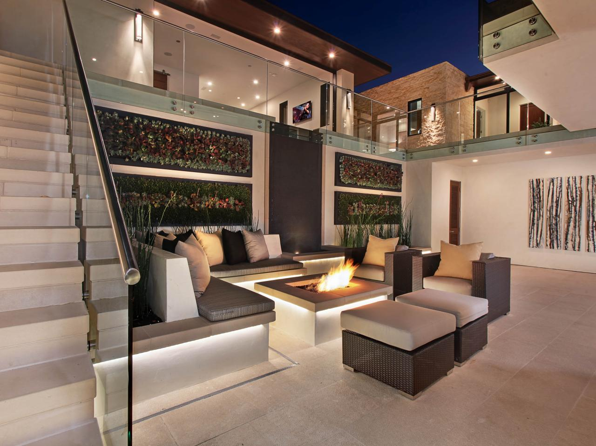
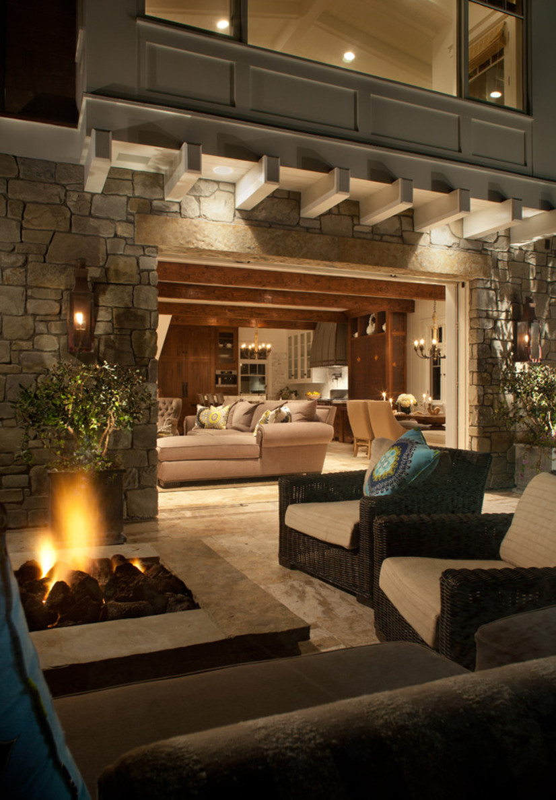
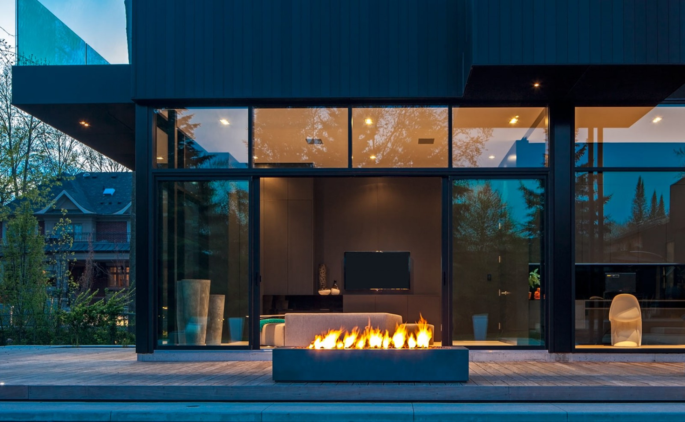

There’s something mesmerizing and comforting about watching a fire, provided it’s in a controlled environment, and at this time of year as the nights in Australia are becoming colder, heating is again returning to the forefronts of our minds.

Fire pits have certainly become a popular trend and the great thing is that they come in a wide variety of shapes and sizes to suit all styles of homes. If you have the space you may want to consider a rustic built in style fire pit, or for smaller areas and alfresco’s there are many table top fire pits that add just as much warmth and ambience. Have a look at some great fire pit design ideas below:

