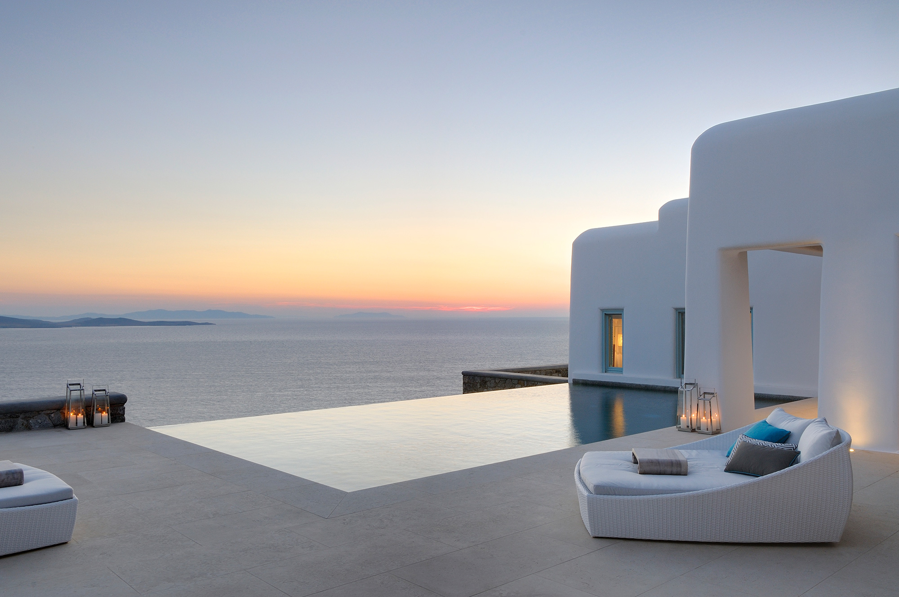
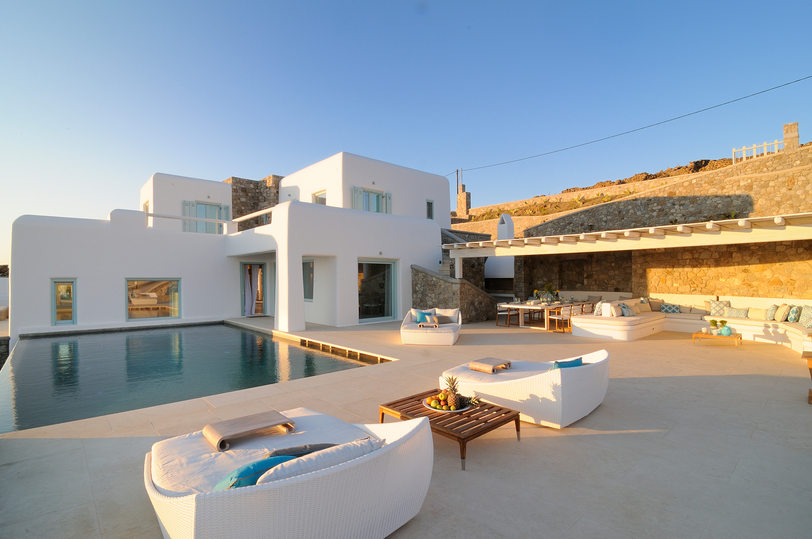

## Design

Etu II boasts all the main elements that characterize traditional Cycladic architecture: the cubic shape with the smooth corners, the whitewashed walls, the flat roofs and the window shutters that add a touch of baby blue in the villa’s façade. White, shades of blue and earth tones dominate the colour scheme, emulating the natural palette of the Mykonian scenery.

> This high-style island hideaway was designed to offer breathtaking views of the Aegean Sea and the island of Rhenia,
> while affording guests with an accommodation experience which rivals that of the premium resorts.

